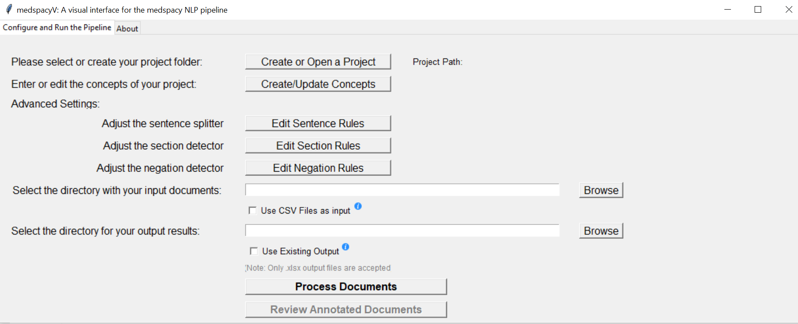
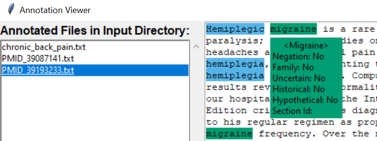

[](https://github.com/medspacy/medspacyV/actions/workflows/ci.yml)
[](https://opensource.org/licenses/MIT)
[](https://www.python.org/downloads/)
[](https://github.com/astral-sh/ruff)
[](https://github.com/medspacy/medspacyV/releases)

# medspacyV: A Visual Interface for the medspacy NLP Pipeline

`medspacyV` is a desktop application specifically for Windows OS that provides a visual interface to interact with the medspacy NLP pipeline. Developed by the Mayo Clinic's Center for Clinical and Translational Science (CCaTS) Informatics Team, it allows users to configure and run medspacy's clinical text processing models without needing to write code.

This application helps in annotating clinical texts, detecting various concepts, and processing notes with a user-friendly graphical interface.

## Project Structure

- **helper/** — Annotation viewer and shared constants
- **resources/** — NLP rule and configuration files (`concepts.xlsx`, `context_rules.json`, `section_rules.tsv`, `sentence_rules.tsv`)
- **tests/** — Unit and integration tests
- **docs/** — Architecture and reference documentation
- `controller.py` — Entry point, MVC wiring
- `model.py` — Core NLP pipeline and file processing
- `view.py` — Tkinter GUI
- `controller.spec` — PyInstaller build configuration
- `pyproject.toml` — Project metadata and dependencies

## Application Preview

<p align="center">
  
</p>

<p align="center">
  
</p>

## Installation and Setup

> **Just want to run the app?** Download `Controller.exe` from the [Releases page](https://github.com/medspacy/medspacyV/releases) — no Python required.

### Prerequisites (developers only)

- Python 3.8.10 or higher

### Clone the Repository

```bash
git clone https://github.com/medspacy/medspacyV
cd medspacyV
```

### Create Virtual Environment and Install Dependencies

```bash
python -m venv .venv

# Windows
.venv\Scripts\activate

# macOS / Linux
source .venv/bin/activate

pip install -e ".[dev]"
python -m spacy download en_core_web_sm
```

> **Prefer uv?** Replace `pip install` with `uv pip install` — everything else stays the same.

### Get Started

To launch the application:

```bash
python controller.py
```

### Building the EXE

The EXE is built automatically via GitHub Actions on every release tag (`v*.*.*`). To build locally on Windows:

```bash
python create_splash_image.py  # one-time, generates splash_image.PNG
pyinstaller controller.spec --noconfirm
# Output: dist/Controller.exe
```
