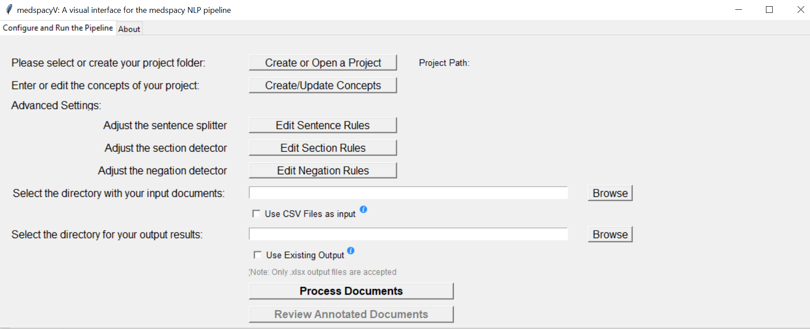
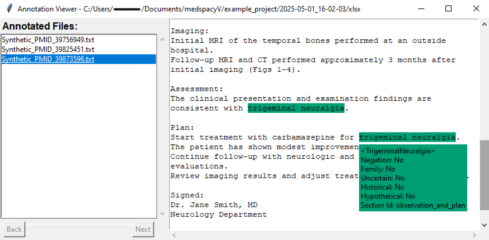

[](https://opensource.org/licenses/MIT)


# medspacyV: A Visual Interface for the MedSpacy NLP Pipeline

`medspacyV` is a desktop application specifically for Windows OS that provides a visual interface to interact with the MedSpacy NLP pipeline. Developed by the Mayo Clinic’s Center for Clinical and Translational Science (CCaTS) Informatics Team, it allows users to configure and run MedSpacy's clinical text processing models without needing to write code.

This application helps in annotating clinical texts, detecting various concepts, and processing notes with a user-friendly graphical interface.

## Project Strucutre
- **helper/** - Contains helper modules  
  - `__init__.py`
  - `annotations.py`
  - `constants.py`

- **resources/** - Rule and configuration files  
  - `concepts.xlsx`
  - `context_rules.json`
  - `exclude_terms.txt`
  - `section_rules.tsv`
  - `sentence_rules.tsv`

- `.gitignore` - Git ignore file  
- `controller.py` - Main application controller  
- `controller.spec` - PyInstaller configuration  
- `create_splash_image.py` - Script to create a splash image  
- `debug.log` - Log file  
- `model.py` - Core processing logic  
- `README.md` - Project documentation  
- `requirements.txt` - Dependencies list  
- `splash_image.PNG` - Splash screen image  
- `view.py` - UI module  

## Application Preview

<p align="center">
  
</p>

<p align="center">
  
</p>

## Installation and Setup

### Prerequisites
Python 3.8.10 or higher is preferred for best compatibility.

### Clone the Repository

```bash
    git clone https://mclm@dev.azure.com/mclm/medspacyV/_git/medspacyV
    cd medspacyV
```

### Create Virtual Environment and Activate

```bash
    python -m venv application
```

- On Windows:
```bash
    application\Scripts\activate
```

### Install Dependencies
Ensure you have Python installed (preferably Python 3.8+), then install the required dependencies:

```bash
    pip install -r requirements.txt  
```

### Get Started

To launch the application please run the following command:

```bash
python controller.py
```

### Create an Executable (.EXE) File
To generate a standalone .exe file using PyInstaller, run:

The following command creates a lauching image which will be used by the .EXE file. It is a one time application, not needed to re-run everytime unless you want to make changes to the image.

```bash
python create_splash_image.py
```

The following command is used to create the .EXE file using pyinstaller.

```bash
pyinstaller --add-data="resources;resources" --add-data="resources;resources/en" --splash=splash_image.png --noconfirm --onefile --windowed Controller.py
```

This will create an executable inside the dist/ folder.

For a full deployment including icons and additional assets, you may customize the PyInstaller configuration in a .spec file.